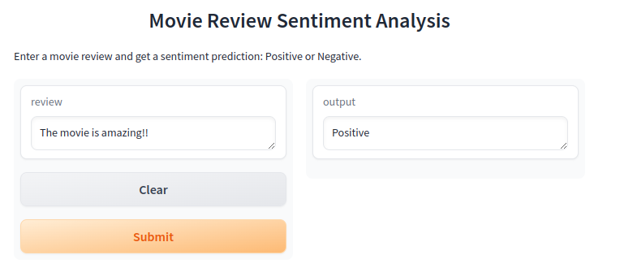

# Sentiment Analysis of Movie Reviews

[](https://huggingface.co/spaces/Umair98392/sentiment)

## Overview

This project focuses on classifying movie reviews from the IMDB dataset using the Naive Bayes classification algorithm, specifically the Multinomial Naive Bayes variant. The IMDB dataset is a popular benchmark dataset for sentiment analysis and consists of 50,000 movie reviews, evenly split into training and testing sets. Each review is labeled as either "positive" or "negative."

The goal of this project is to develop a model that can accurately predict whether a given movie review is positive or negative based on its text content. Additionally, a GUI interface has been created using Gradio, and the project is deployed on Hugging Face Spaces.

## Features

- **Sentiment Analysis**: Classify movie reviews as positive or negative using text-based features.
- **Naive Bayes Algorithm**: Implemented using the Multinomial Naive Bayes variant, which is well-suited for text classification tasks.
- **IMDB Dataset**: Utilized a dataset of 50,000 movie reviews, a common benchmark in sentiment analysis research.
- **Gradio Interface**: A user-friendly GUI to interact with the model, allowing users to input their own movie reviews and get instant sentiment predictions.
- **Deployment**: The project is deployed on Hugging Face Spaces, making it easily accessible to users.

## Usage

### Installation

1. Clone the repository:
    ```bash
    git clone https://github.com/umair98392/iNeuBytes_Internship.git
    cd iNeuBytes_Internship
    ```

2. Install the required dependencies:
    ```bash
    pip install -r requirements.txt
    ```


### How to Use

The project is also deployed on Hugging Face Spaces. You can access the live interface here:

[Gradio Interface on Hugging Face Spaces](https://huggingface.co/spaces/your-username/your-project-name)

## Dataset

- **Source**: [IMDB Dataset](https://ai.stanford.edu/~amaas/data/sentiment/)
- **Size**: 50,000 movie reviews
- **Labels**: Positive, Negative
- **Split**: 25,000 training samples, 25,000 testing samples

## Model

- **Algorithm**: Multinomial Naive Bayes
- **Libraries**: Scikit-learn, NLTK, Gradio

## Deployment

- **Platform**: Hugging Face Spaces
- **Interface**: Gradio

## Contributing

If you'd like to contribute to this project, please fork the repository and use a feature branch. Pull requests are welcome.
